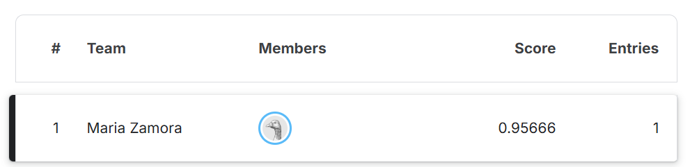

# 🔥 Wildfire Detection using CNNs (1st Place – UH AI Hackathon)

## 🏆 Overview
This project was developed during the University of Houston AI Hackathon, where our team placed **1st**.

We built a convolutional neural network (CNN) to classify images based on the presence of fire, simulating a real-time wildfire detection system.

---

## 📊 Dataset
- Binary classification:
  - **0 → No Fire**
  - **1 → Fire**
- Training dataset with labeled images  
- Test dataset with unseen images  

---

## ⚙️ Approach
- Image preprocessing and normalization  
- Data augmentation to improve model robustness  
- CNN-based architecture for feature extraction  
- Model evaluation using classification metrics  

---

## 🚀 Results
- Generated predictions for 300 unseen test images
- Achieved **95.7% accuracy (0.95666 score)** on the final Kaggle leaderboard
- Ranked **🥇 1st Place overall** in the UH AI Hackathon competition
- Built a complete end-to-end image classification pipeline using CNNs

---

## 🏆 Competition Result

Achieved a score of **0.95666** and ranked **1st place** on the final leaderboard.

---

## 💻 Tech Stack
- Python  
- PyTorch  
- Kaggle  

---

## 📂 Project Files
- `wildfire_detection_cnn.ipynb` – main model and training pipeline  

---

## 👥 Team
This project was developed collaboratively during the UH AI Hackathon.

- Maria Zamora  
- Philip Le
- Matthias Rodriguez
